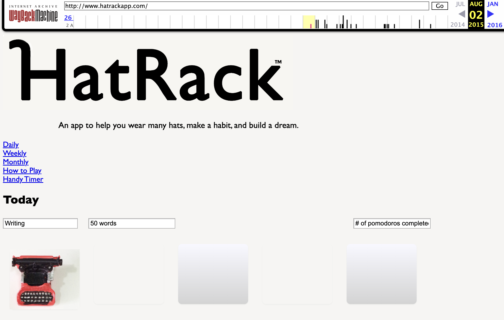
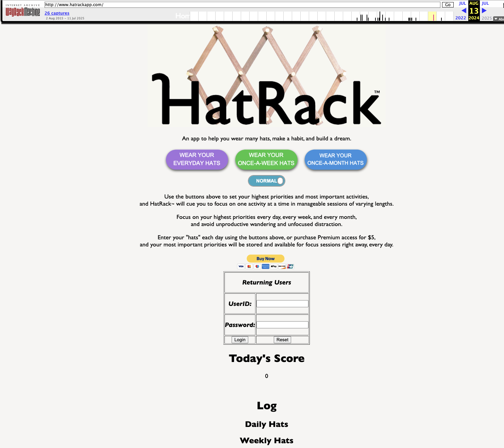
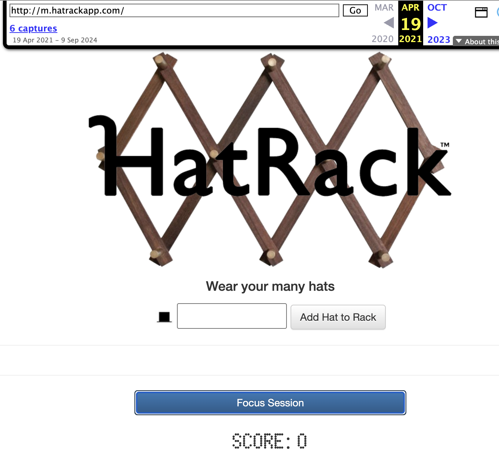

# hatrack-app

The first version of HatRack™, created by Owen Temple and originally launched at hatrackapp.com in July 2015.

*An app to help you wear many hats, make a habit, and build a dream.*

The idea behind HatRack: most of us juggle multiple roles and projects — we "wear many hats." HatRack lets users put all their hats on the rack — Writing, Reading, Coding, Performing, Listening, or whatever roles and projects compete for their attention — then randomly draws one hat at a time with a timed focus session of varying length. Wear one hat, then move on to the next. It tracks habits, keeps score, logs sessions, and offers a Premium tier for saved priorities across daily, weekly, and monthly timeframes.

*hatrackapp.com, 2015*

Built with HTML, JavaScript, jQuery, Knockout.js, and CSS. Originally hosted at hatrackapp.com beginning July 2015. This legacy version is now archived at [legacy.hatrack.it](https://legacy.hatrack.it).

*hatrackapp.com, 2024*

A phone-friendly version of HatRack is also available at m.hatrackapp.com.

*m.hatrackapp.com, 2021*

The idea keeps evolving. The current version of HatRack lives at [hatrack.it](https://hatrack.it), rebuilt from the ground up as a modern web app (see [hatrack repo](https://github.com/owentemple/hatrack)), but the core concept is the same one that started here: pick a hat, start a timer, do the work.

© 2015 HatRack, LLC
